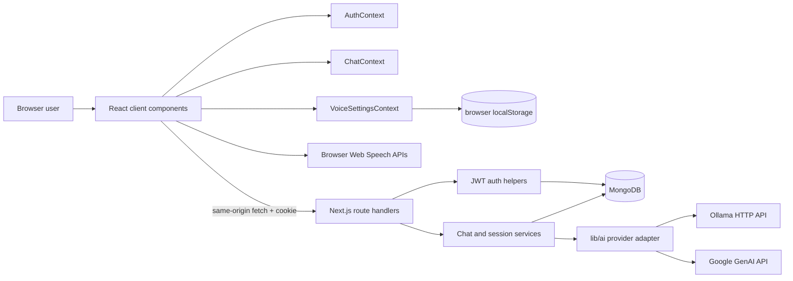

# Voice Assistant — Complete Project Handoff

> **Repository:** `voice-assistant`<br>
> **Audited revision:** `bf0012d` (`ollama-api-used`) on `main`<br>
> **Audit date:** 12 September 2026<br>
> **Audience:** future engineering, product, QA, and DevOps contributors

## 1. Purpose and Current State

Voice Assistant is a full-stack web application for text and voice-enabled AI conversations. It provides a responsive chat UI, optional account authentication, MongoDB-backed conversation history for signed-in users, browser-native speech input/output, and a provider abstraction that now supports **Ollama and Google Gemini**.

The app is a Next.js 16 App Router project. The current local configuration selects **Ollama** and requests `gemma4:31b`; Gemini remains available as a configurable alternative. AI replies are non-streaming: the UI waits for a complete answer, stores it for a persisted chat, then optionally speaks it aloud.

The optimized production build passes at the audited revision. `npm run lint` does not pass; its exact result is listed in [Verification and quality status](#13-verification-and-quality-status). There is no automated test suite or CI workflow in the repository.

## 2. Product Capabilities

| Area | Current behavior |
| --- | --- |
| AI chat | A user sends a text prompt and receives one complete AI response. The server chooses Ollama or Gemini from environment configuration. |
| Conversation context | For persisted chats, the latest 20 stored messages are loaded in chronological order and sent with the new prompt. |
| Guest use | A user can use the chat UI without signing in. Guest messages are not stored, and no session ID is returned. MongoDB is nevertheless required because the chat route connects before processing. |
| Accounts | Registration, login, logout, and session restoration use bcrypt password hashes and a JWT in an HTTP-only cookie. |
| Chat history | Signed-in users get persisted sessions, session selection, message loading, rename, delete, and recency grouping. |
| Voice input | Browser Web Speech recognition fills the chat input; configured language is `en-IN`. Browser support is required. |
| Voice output | Browser speech synthesis can auto-read answers. The user can choose a voice and adjust rate, pitch, volume, auto-speak, preview, and reset. |
| Responsive UX | A desktop sidebar becomes a slide-in sidebar on smaller screens. `/` and `/assistant` show the same application shell. |

## 3. Technology Stack

| Layer | Technology | Responsibility |
| --- | --- | --- |
| Framework | Next.js `16.2.10`, App Router | Pages, root layout, dynamic route handlers, optimized builds. |
| UI | React `19.2.4`, TypeScript | Client-side shell, contexts, hooks, and typed components. |
| Styling | Tailwind CSS 4, `tw-animate-css`, shadcn/base-nova configuration | Dark responsive visual system and UI primitives. |
| Database | MongoDB + Mongoose `9.8.0` | Users, sessions, and messages. |
| Authentication | `bcryptjs`, `jsonwebtoken` | Password hash comparison and seven-day JWT cookie. |
| AI | `@google/genai` plus native `fetch` to Ollama HTTP API | Provider-specific chat generation and model listing. |
| Forms | React Hook Form, Zod, `@hookform/resolvers` | Client and server authentication validation. |
| Voice | Web Speech API | Speech recognition and speech synthesis in supported browsers. |
| UI support | Lucide, Base UI, CVA, `clsx`, `tailwind-merge`, Sonner | Icons, primitives, variants, class merging, notifications. |
| Tooling | ESLint 9, TypeScript 5, PostCSS | Static checks and Tailwind transformation. |

Installed packages not found on the active feature path include `axios`, `framer-motion`, and `zustand` (Axios may be available for future work but current API calls use `fetch`).

## 4. Repository Structure

Generated and private directories (`node_modules/`, `.next/`, `.git/`, `.env.local`) are intentionally omitted. The root `.gitignore` ignores `.env*`, build output, and `*.txt`; `folder-structure.txt`, `plan.txt`, and `status.txt` exist locally but are untracked because of that rule.

```text
voice-assistant/
├── .postman/
│   └── resources.yaml
├── app/                                  # App Router routes and global styling
│   ├── api/
│   │   ├── auth/
│   │   │   ├── login/route.ts
│   │   │   ├── logout/route.ts
│   │   │   ├── me/route.ts
│   │   │   └── register/route.ts
│   │   ├── chat/route.ts
│   │   ├── models/route.ts
│   │   ├── sessions/
│   │   │   ├── [sessionId]/messages/route.ts
│   │   │   ├── [sessionId]/route.ts
│   │   │   └── route.ts
│   │   └── test/route.ts
│   ├── assistant/page.tsx
│   ├── favicon.ico
│   ├── globals.css
│   ├── layout.tsx
│   └── page.tsx
├── components/
│   ├── assistant/{AssistantAvatar,AssistantBubble,AssistantHeader,AssistantStatus}.tsx
│   ├── auth/{AuthButton,AuthDialog,LoginDialog,RegisterDialog}.tsx
│   ├── chat/{AssistantMessage,CategoryBadge,ChatWindow,LoadingMessage,MessageList,TypingDots,UserMessage}.tsx
│   ├── common/{Button,GlassCard,GlowOrb,Logo}.tsx
│   ├── input/{ChatInput,VoiceButton}.tsx
│   ├── layout/{AppLayout,MainContent}.tsx
│   ├── sidebar/{NewSessionButton,SessionGroup,SessionItem,Sidebar}.tsx
│   ├── ui/{alert-dialog,button,dialog,dropdown-menu,input,label}.tsx
│   └── voice/{AutoSpeakToggle,PitchSlider,PreviewButton,RateSlider,ResetVoiceButton,SettingsPanel,VoiceSelector,VolumeSlider}.tsx
├── constants/voice.ts                    # Default browser voice settings
├── context/{AuthContext,ChatContext,VoiceSettingsContext}.tsx
├── hooks/{useAuth,useSpeechRecognition,useSpeechSynthesis,useVoiceSettings}.ts
├── lib/{ai,auth,gemini,mongodb,ollama,utils}.ts
├── models/{ChatSession,Message,User,VoiceSetting}.ts
├── postman/globals/workspace.globals.yaml # Postman workspace globals
├── public/                               # Starter SVG assets
│   └── {file,globe,next,vercel,window}.svg
├── schemas/{auth,authForm}.schema.ts
├── services/
│   ├── auth.client.ts
│   ├── {auth,chat-processing,chat,message,session-processing,session}.service.ts
├── settings/ai.config.ts                 # Environment-driven AI selection/settings
├── types/{api,chat,message,session,voice}.ts
├── types/speech.d.ts
├── utils/{groupSessions,localStorage}.ts
├── AGENTS.md                             # Repository-specific Next.js instruction
├── CLAUDE.md
├── README.md                             # Public readme; partially stale (Gemini-only wording)
├── PROJECT_SUMMARY.md                    # This handoff document
├── package.json / package-lock.json
├── tsconfig.json
├── eslint.config.mjs
├── postcss.config.mjs
├── components.json                        # shadcn component settings
└── next.config.ts                         # Empty/default Next configuration
```

## 5. Runtime Architecture



### Rendering and state composition

```text
RootLayout
├── AuthProvider
│   ├── VoiceSettingsProvider
│   │   └── AppLayout (at / and /assistant)
│   │       └── ChatProvider
│   │           ├── Sidebar
│   │           └── MainContent
│   │               ├── AssistantHeader
│   │               ├── SettingsPanel
│   │               ├── ChatWindow
│   │               └── ChatInput / VoiceButton
│   └── Sonner toaster
```

`app/layout.tsx` is a server layout that supplies metadata and fonts. Most interactive components are client components. Route handlers are dynamic server endpoints; the audited production build marks only `/` and `/assistant` as static pages.

## 6. Core Workflows

### 6.1 Send a chat message

```text
1. MainContent validates a non-empty input and appends the user message optimistically.
2. services/chat.service.ts POSTs { message, sessionId? } to /api/chat.
3. app/api/chat/route.ts opens/reuses the MongoDB connection and invokes processChat.
4. processChat reads the JWT cookie, if present.
5. For a signed-in user without a session, it creates ChatSession using the first prompt as title.
6. For a persisted session, it saves the user message and fetches up to 20 newest messages, ordered oldest → newest.
7. It builds provider-neutral messages, chooses AI_CONFIG.MODEL, and calls lib/ai.ts.
8. lib/ai.ts routes to lib/ollama.ts or lib/gemini.ts.
9. The completed reply is saved for persisted sessions and returned with sessionId.
10. The UI appends the assistant reply, refreshes the sidebar for a newly created session, and calls speech synthesis when auto-speak is enabled.
```

**Important implementation note:** the user message is stored before history is loaded and is then appended again to the outbound message list. For persisted chats, the newest prompt is therefore sent to the model twice. This is a known defect, not intended context behavior.

### 6.2 Authentication

```text
Register: dialog → Zod validation → POST /api/auth/register → bcrypt hash → User document
Login:    dialog → POST /api/auth/login → bcrypt compare → signed JWT → auth-token HTTP-only cookie
Restore:  AuthProvider mount → GET /api/auth/me → verify JWT → retrieve public user profile
Logout:   profile control → POST /api/auth/logout → expire auth-token → clear client auth state
```

The JWT contains `userId` and `email`, expires in seven days, uses `sameSite: "lax"`, `httpOnly: true`, `path: "/"`, and is marked `secure` only when `NODE_ENV === "production"`.

### 6.3 Session history

```text
Signed-in Sidebar mount → GET /api/sessions → sessions sorted by ChatSession.updatedAt descending
Click a session             → GET /api/sessions/:id/messages → messages sorted createdAt ascending
Rename                      → PATCH /api/sessions/:id with { title }
Delete                      → DELETE /api/sessions/:id → delete Message documents, then ChatSession
New Session                 → clear in-memory messages and activeSessionId; persistence begins with next prompt
```

`groupSessions` renders the sidebar sections **Today**, **Yesterday**, **Previous 7 Days**, and **Older**.

### 6.4 Voice controls

`useSpeechRecognition` creates `SpeechRecognition` or `webkitSpeechRecognition` where supported, uses continuous interim results, and feeds the transcript into the text input. `useSpeechSynthesis` retrieves browser voices and speaks completed replies using the selected settings. Preferences are stored under the `voice-settings` localStorage key and synchronized with other tabs through the storage event.

Voice preferences do **not** currently use the database, despite the presence of a `VoiceSetting` Mongoose model.

## 7. AI Provider and Model Design

### Provider selection

`settings/ai.config.ts` reads `AI_PROVIDER`, normalizes it to lowercase, and supports `gemini` or `ollama`. The default when the variable is absent is `ollama`.

| Provider | Client/module | Chat endpoint/call | Model source |
| --- | --- | --- | --- |
| Ollama | `lib/ollama.ts` | `POST {OLLAMA_BASE_URL}/api/chat` with `stream: false` | `OLLAMA_MODEL`, default `gemma4:31b` |
| Gemini | `lib/gemini.ts` | `GoogleGenAI.models.generateContent` | `GEMINI_MODEL`, default `models/gemini-3.8-flash` |

`lib/ai.ts` is the provider-neutral seam. `generateChatCompletion()` delegates generation and `listAvailableModels()` delegates model enumeration. API consumers call only that seam:

- `services/chat-processing.service.ts` uses `generateChatCompletion()`.
- `GET /api/models` returns `{ models }` from the active provider.

### Ollama request behavior

`lib/ollama.ts` accepts `user`, `assistant`, and `system` roles directly. It sends JSON, attaches `Authorization: Bearer <OLLAMA_API_KEY>` only when a key is configured, maps temperature to `options.temperature`, maps output-token limit to `options.num_predict`, and throws on non-2xx HTTP responses. It also lists active-endpoint models through `GET /api/tags`.

The default base URL is `https://ollama.com`; a local Ollama server requires setting `OLLAMA_BASE_URL` to its reachable URL (for example, its local host/port). The code does not start, install, pull, or health-check an Ollama runtime.

### Gemini request behavior

`lib/gemini.ts` converts `assistant` roles to Gemini's `model` role; every other role is sent as `user`. This means a future system prompt would not retain a distinct Gemini system role without additional adapter work. It passes temperature and `maxOutputTokens` to the Google GenAI SDK.

### Current effective configuration

The audited local environment selects Ollama and configures the requested Ollama model as `gemma4:31b`, temperature `0.7`, and maximum output `2048`. These values are environment-specific; never commit credentials or copy their values into this document.

## 8. Data Model

| Collection/model | Fields | Usage |
| --- | --- | --- |
| `User` | `name`, unique lowercased `email`, bcrypt `password`, timestamps | Registration, login, profile restoration. |
| `ChatSession` | `userId` reference, trimmed `title`, timestamps | One persisted conversation container per signed-in chat. |
| `Message` | `sessionId` reference, `role` (`user`/`assistant`), trimmed `content`, timestamps | Persisted message history. |
| `VoiceSetting` | unique `userId`, `voiceURI`, `rate` 0.5–2, `pitch` 0–2, `volume` 0–1, `autoSpeak`, timestamps | Schema exists only; no route or UI currently reads/writes it. |

There are Mongoose references but no defined cascade behavior or database indexes beyond the unique `User.email` and `VoiceSetting.userId` schema declarations. Delete is implemented manually by deleting messages before a chat session.

## 9. API Contract

| Method and route | Auth | Request | Response / purpose |
| --- | --- | --- | --- |
| `POST /api/auth/register` | Public | `{ name, email, password }` | Creates hashed user; returns success/profile result. |
| `POST /api/auth/login` | Public | `{ email, password }` | Validates credentials, sets cookie, returns profile result. |
| `POST /api/auth/logout` | Cookie cleared | None | Expires `auth-token`. |
| `GET /api/auth/me` | Required | None | Returns current user profile or 401. |
| `POST /api/chat` | Optional | `{ message, sessionId?: string }` | `{ reply, sessionId }`; saves content when a session is in use. |
| `GET /api/sessions` | Required | None | Current user's sessions, newest first. |
| `GET /api/sessions/:sessionId/messages` | Required + ownership checked | None | Session messages, oldest first. |
| `PATCH /api/sessions/:sessionId` | **Missing check** | `{ title }` | Renames a session. |
| `DELETE /api/sessions/:sessionId` | **Missing check** | None | Deletes a session and its messages. |
| `GET /api/models` | Public | None | `{ models }` from selected provider. |
| `POST /api/test` | Public | None | Creates a hard-coded test user; development-only endpoint. |

The app currently has no API version prefix, shared error-envelope type, request rate limiting, or streaming response contract.

## 10. Configuration and Local Setup

### Required environment variables

Create a private `.env.local` file. It is correctly ignored by Git; use a secret manager or deployment environment variables in hosted environments.

```env
# Database and auth
MONGODB_URI=<MongoDB connection string>
JWT_SECRET=<long random signing secret>

# Select one provider
AI_PROVIDER=ollama                 # or gemini

# Ollama (required when AI_PROVIDER=ollama)
OLLAMA_BASE_URL=<Ollama server URL>
OLLAMA_API_KEY=<optional provider/server token>
OLLAMA_MODEL=gemma4:31b
OLLAMA_TEMPERATURE=0.7
OLLAMA_MAX_OUTPUT_TOKENS=2048

# Gemini (required when AI_PROVIDER=gemini)
GEMINI_API_KEY=<Google AI API key>
GEMINI_MODEL=models/gemini-3.8-flash
```

`NEXT_PUBLIC_API_URL` may exist in local configuration but is not read by the current code. The existing README uses an obsolete `NEXTAUTH_SECRET` example; this project uses `JWT_SECRET`, not NextAuth.

### Commands

```bash
npm install
npm run dev       # local development server
npm run lint      # ESLint (currently fails; see Section 13)
npm run build     # optimized build (passes at audited revision)
npm start         # serve a production build
```

## 11. Changes in the Latest Ollama Integration

Latest commit: `bf0012d ollama-api-used`.

| File | Change |
| --- | --- |
| `lib/ai.ts` | **New.** Introduced provider-neutral request types plus generation/model-list dispatch. |
| `lib/ollama.ts` | **New.** Added Ollama URL/key handling, `/api/chat` generation, `/api/tags` model listing, JSON/error handling, and non-streaming options. |
| `settings/ai.config.ts` | Switched from Gemini-only constants to environment-driven provider/model configuration; default provider is Ollama. |
| `lib/gemini.ts` | Converted from a directly exported client usage pattern into compatible generation/model-list helper functions; retained the `ai` export. |
| `services/chat-processing.service.ts` | Replaced direct Gemini generation with `generateChatCompletion()` and now passes model, temperature, and output-token configuration. |
| `app/api/models/route.ts` | Replaced direct Gemini listing with active-provider listing and wraps output as `{ models }`. |
| `README.md` | Modified in the commit, but its visible feature/architecture sections still describe a Gemini-only implementation and need alignment. |

No dependency changes appear in the latest commit. The integration uses the platform `fetch` API for Ollama rather than adding an Ollama SDK.

## 12. Known Issues, Risks, and Recommended Next Work

Address the first four items before calling the application production-ready.

| Priority | Finding | Impact | Recommended fix |
| --- | --- | --- | --- |
| Critical | Session `PATCH` and `DELETE` do not authenticate or constrain queries by `userId`. | Someone knowing a session ID could rename or delete another user's chat. | Call `getAuthenticatedUser()` and use `{ _id: sessionId, userId }` in both operations. |
| Critical | `processChat` accepts any supplied `sessionId` without verifying ownership. | A caller can append messages to another user's session; guest callers can also supply an ID. | Require a signed-in owner for existing sessions and query by `_id` plus authenticated `userId` before saving. |
| High | Persisted message workflow sends the newest user message twice to the AI provider. | Duplicated prompt content can degrade response quality and add token cost. | Load history before saving the current message, or omit the explicit appended message when history already includes it. |
| High | No automated tests, CI, rate limiting, or API abuse controls. | Regressions and public AI endpoint cost/availability risks are unchecked. | Add unit/integration tests, GitHub Actions, per-user/IP limits, input limits, and provider failure tests. |
| High | `POST /api/test` is public and creates a known test account with a plaintext password field. | Unwanted database writes and unsafe endpoint exposure. | Remove it or restrict it to a non-production development environment. |
| Medium | `ChatSession.updatedAt` is not updated when child `Message` documents are created. | Sidebar sorting/grouping reflects session creation or rename, not most recent conversation activity. | Touch the session after each successful message pair or maintain `lastMessageAt`. |
| Medium | The chat route opens MongoDB even for non-persistent guest messages. | Guest AI availability unnecessarily depends on MongoDB. | Connect only when authentication/session persistence is required. |
| Medium | `AI_CONFIG.PROVIDER` uses a type assertion without runtime validation. | Invalid `AI_PROVIDER` fails only when a request reaches the provider adapter. | Validate configuration at startup with Zod or an explicit allowlist and a clear error. |
| Medium | Gemini system messages are mapped to `user`; Ollama accepts system roles. | Cross-provider behavior is not fully semantically equivalent. | Define a provider-neutral system-instruction contract and map it intentionally per SDK. |
| Medium | README and the prior project summary are Gemini-only/stale. | Onboarding can configure the wrong provider or secret name. | Keep README synchronized with this file and add a committed `.env.example` containing placeholders only. |
| Low | Voice settings persist only by browser/localStorage. | Preferences do not roam with an authenticated user. | Add authenticated `VoiceSetting` read/write APIs if cross-device settings are desired. |
| Low | Assistant output is plain text, not Markdown, and generation is non-streaming. | Rich formatting and perceived responsiveness are limited. | Add a safe Markdown renderer and provider streaming protocol when needed. |

### Secret-handling note

This audit intentionally excludes credential values. If any real database URL, JWT secret, Gemini key, or Ollama token has ever been committed, pasted into tickets/chat, or otherwise exposed, rotate it immediately and invalidate/redeploy the affected environment. Keep `.env.local` private and commit only a placeholder-based `.env.example`.

## 13. Verification and Quality Status

| Check | Result | Evidence |
| --- | --- | --- |
| Production build | Pass | `npm run build` completed successfully with Next.js 16.2.10. It generated static `/` and `/assistant` routes and dynamic API routes. |
| TypeScript during build | Pass | Next.js completed its build-time TypeScript phase. |
| ESLint | Fail | `npm run lint` reported **9 errors** and **17 warnings**. |
| Automated tests | Not present | No test/spec files or test script were found. |
| CI | Not present | No repository workflow configuration was found. |
| Live provider/database smoke test | Not performed | It would call external services and mutate or consume scoped resources; configuration review and build verification were performed instead. |

Lint errors are in `app/api/chat/route.ts`, `app/api/models/route.ts`, `app/api/sessions/route.ts`, `app/api/sessions/[sessionId]/messages/route.ts`, `components/sidebar/SessionItem.tsx`, `lib/gemini.ts`, and `services/chat-processing.service.ts`. Most are explicit `any` violations; `SessionItem` also synchronously sets state in an effect. Warnings include unused variables/imports and an incomplete React Hook dependency list.

## 14. Ownership Map for Future Contributors

| Need to change | Start here | Follow through |
| --- | --- | --- |
| Add/change AI provider | `lib/ai.ts`, `settings/ai.config.ts` | Implement adapter, model list, environment docs, tests. |
| Change Ollama behavior | `lib/ollama.ts` | Validate endpoint/auth/model semantics and update `.env.example`/README. |
| Change prompt/history rules | `services/chat-processing.service.ts` | Preserve role conversion, persistence order, ownership checks, and test both providers. |
| Add a chat UI feature | `components/layout/MainContent.tsx`, `context/ChatContext.tsx` | Add service/API/type updates only as necessary. |
| Add a session operation | `app/api/sessions/**`, `services/session*.ts` | Authenticate and scope every database operation to the session owner. |
| Change auth | `lib/auth.ts`, `services/auth.service.ts`, `app/api/auth/**`, `context/AuthContext.tsx` | Consider cookie flags, token lifetime, validation, and profile restoration. |
| Change voice settings | `context/VoiceSettingsContext.tsx`, `hooks/useSpeech*.ts`, `components/voice/**` | Account for unsupported browsers and localStorage synchronization. |
| Change schemas | `models/**`, `schemas/**`, `types/**` | Plan migration/index implications and update all route validation. |

## 15. Handoff Checklist

1. Read this document, `README.md`, and `AGENTS.md` before changing framework code.
2. Configure a private `.env.local` using the variables in Section 10; do not share secrets in source control.
3. Decide the intended deployment model: hosted Ollama endpoint versus local/runtime-managed Ollama, or Gemini fallback.
4. Fix session authorization and duplicate-prompt behavior before opening the app to real users.
5. Add test coverage around registration/login, authorization boundaries, guest/persisted chat, provider selection, and Ollama error handling.
6. Make lint clean, establish CI, then update this document whenever the architecture, provider contract, model defaults, or environment variables change.
