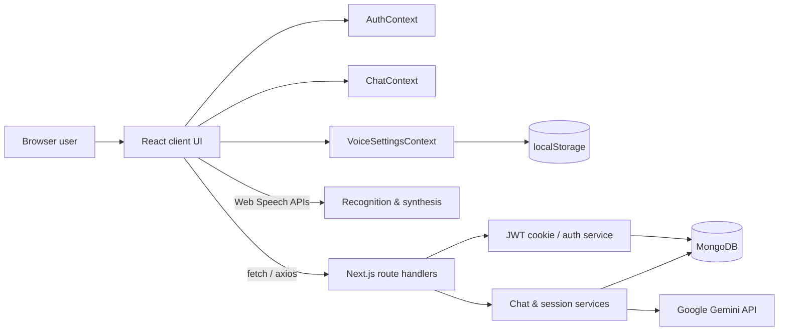
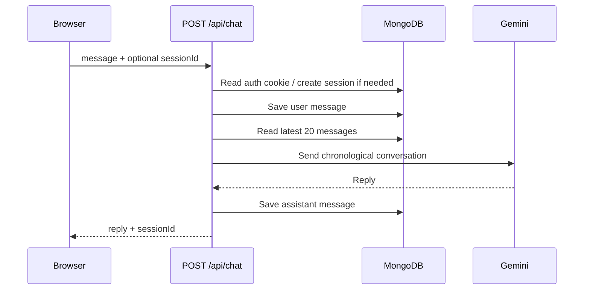

# Voice Assistant — Version 1.0 Project Brief

> **Purpose:** Durable technical, product, handoff, and interview reference for the `voice-assistant` repository.
>
> **Audit basis:** repository state at commit `926dda6` (`main`), reviewed on 4 August 2026. This document describes code that exists in the repository, distinguishes verified behavior from roadmap intent, and does not expose secret values.

## 1. Executive Summary

Voice Assistant is a full-stack, browser-based AI conversation application. It combines a responsive Next.js interface, Gemini-powered responses, MongoDB-backed accounts and conversation history, JWT-cookie authentication, and browser-native speech recognition and speech synthesis.

The project demonstrates a well-chosen full-stack learning architecture:

- **Frontend:** React client components, reusable UI primitives, Tailwind CSS, responsive desktop/mobile layouts, React Context state management, and accessible dialog/menu foundations.
- **Backend:** Next.js App Router route handlers, a services layer, Zod validation for authentication, Mongoose data models, and structured API client helpers.
- **AI:** Google GenAI SDK integration with session-based conversational context, retaining the latest 20 persisted messages for each Gemini request.
- **Voice:** Web Speech API input and output, configurable voice/rate/pitch/volume, auto-speak, preview, reset, and local preference persistence.
- **Product UX:** account flows, session history grouped by recency, load/rename/delete chat controls, mobile sidebar, chat status states, automatic scroll, and loading feedback.

It is a strong portfolio prototype and demonstrates meaningful end-to-end engineering. A successful optimized production build was verified during this audit. However, it should not yet be represented as a fully production-ready deployment: lint does not pass, automated tests/CI/deployment evidence are absent, guest chat has a confirmed code-path bug, and session mutations are missing authorization and ownership checks. Section 12 lists the concrete release blockers.

## 2. Product Scope and User Value

### Primary users

1. **Guest users** can open the assistant, type or dictate a prompt, and use local voice controls. Guest conversations are intended to be non-persistent.
2. **Registered users** can create an account, authenticate through a seven-day HTTP-only session cookie, retain chat sessions in MongoDB, reopen them, rename them, and delete them.

### Core user journeys

| Journey | Implemented behavior |
| --- | --- |
| Ask a question | User writes a prompt or dictates it; the UI displays a thinking state and sends it to Gemini. |
| Hear an answer | When Auto Speak is enabled, the browser reads the returned answer using the chosen speech-synthesis settings. |
| Create an account | The registration form validates locally and server-side, hashes the password, and creates a MongoDB user. |
| Sign in and restore a session | Login issues an HTTP-only JWT cookie. `AuthProvider` calls `/api/auth/me` when the app loads to restore the profile state. |
| Start a persisted chat | For an authenticated user with no selected session, the first message creates a `ChatSession`; user and assistant messages are stored. |
| Continue a prior chat | Sidebar session selection fetches persisted messages; new requests use the selected session ID and recent history as Gemini context. |
| Organize chats | Sidebar groups sessions by `updatedAt` into Today, Yesterday, Previous 7 Days, and Older; sessions can be renamed or deleted. |
| Configure voice | Settings panel changes selected browser voice, rate, pitch, volume, and auto-speak. Preferences live in localStorage and update across tabs. |

## 3. Technology Stack

| Layer | Technology | How it is used |
| --- | --- | --- |
| Framework | Next.js `16.2.10`, App Router | Pages, layouts, API route handlers, static/dynamic production build. |
| UI | React `19.2.4`, TypeScript | Client components and typed application state. |
| Styling | Tailwind CSS `4`, `tw-animate-css`, shadcn theme CSS | Dark responsive design system and utility styling. |
| UI primitives | Base UI, Lucide React, CVA, `clsx`, `tailwind-merge` | Buttons, dialogs, dropdowns, icons, variants, utility merging. |
| Forms | React Hook Form, Zod, `@hookform/resolvers` | Auth form state and client validation. |
| Database | MongoDB + Mongoose `9.8.0` | Users, chat sessions, messages, and prepared voice-settings schema. |
| Authentication | `bcryptjs`, `jsonwebtoken` | Password hashing and seven-day JWT embedded in HTTP-only cookie. |
| AI | `@google/genai` | Gemini `models/gemini-flash-latest` response generation. |
| Voice | Browser Web Speech APIs | `SpeechRecognition`/`webkitSpeechRecognition` and `speechSynthesis`. |
| Networking | Fetch and Axios | Chat/session requests and authentication client. |
| Notifications | Sonner | Login, registration, and logout confirmation/error toasts. |

Installed but not materially used by the current feature path: `framer-motion`, `zustand`, and several starter/common visual components.

## 4. Architecture



### Code organization

| Area | Responsibility |
| --- | --- |
| `app/` | App Router pages, root layout, CSS, and HTTP route handlers. |
| `components/` | UI split by concern: assistant, auth, chat, input, layout, sidebar, UI primitives, voice. |
| `context/` | Global client state for auth, chat/session state, and voice settings. |
| `hooks/` | Auth re-export and browser speech/voice hooks. |
| `services/` | Server business workflows and client-side API wrappers. |
| `models/` | Mongoose schemas. |
| `schemas/` | Zod authentication and form contracts. |
| `lib/` | Mongo connection cache, JWT utilities, Gemini client, class-name helper. |
| `types/`, `constants/`, `utils/` | Shared contracts, defaults, session grouping, defensive storage helpers. |

### Rendering composition

```text
RootLayout
├─ AuthProvider
│  ├─ VoiceSettingsProvider
│  │  └─ Page (/ or /assistant)
│  │     └─ AppLayout
│  │        └─ ChatProvider
│  │           ├─ Sidebar
│  │           └─ MainContent
│  │              ├─ AssistantHeader
│  │              ├─ SettingsPanel
│  │              ├─ ChatWindow
│  │              └─ ChatInput / VoiceButton
│  └─ Sonner Toaster
```

`/` and `/assistant` currently render the same application shell. The login dialog redirects to `/assistant`; this route is not server-protected, which supports guest use but means it is not a restricted member-only page.

## 5. Feature Inventory and Completion Status

| Feature | Status | Evidence / notes |
| --- | --- | --- |
| Responsive chat interface | Implemented | Desktop sidebar plus slide-in mobile sidebar; responsive headers/input. |
| Text prompts and Gemini replies | Implemented for authenticated sessions | `POST /api/chat` invokes Gemini and renders a loading bubble. |
| Guest prompts | **Blocked by bug** | The resolved `contents` value is not passed to Gemini; an empty history is sent for guests. See issue R1. |
| Registration/login/logout | Implemented | Zod, bcrypt, JWT cookie, profile menu, session restore. |
| Chat persistence | Implemented for authenticated sessions | ChatSession and Message documents are created/read. |
| Conversation memory | Implemented | Most recent 20 stored messages are loaded newest-first and reversed before Gemini receives them. |
| Session sidebar | Implemented | List, grouping, open, new local session, rename, delete UI. |
| Session authorization | **Not implemented safely** | Delete/rename routes have no auth or ownership checks. See issue R2. |
| Browser voice input | Implemented where browser supports it | Recognition language is `en-IN`; recognition result fills the text input. |
| Browser voice output | Implemented | Voice settings and automatic speech synthesis. |
| Voice preference server persistence | Not implemented | `VoiceSetting` schema exists but the live UI uses localStorage only. |
| Markdown/code rendering | Not implemented | Assistant content is plain text with `white-space: pre-wrap`. |
| Streaming AI responses | Not implemented | UI waits for complete Gemini reply, then appends it. |
| Automated test suite | Not implemented | No test/spec files found. |
| CI and verified deployment | Not evidenced in repository | No workflow/deployment configuration or public deployment URL present. |

## 6. Data Model

### `User` (actively used)

| Field | Definition |
| --- | --- |
| `name` | Required trimmed string. |
| `email` | Required, unique, lowercased, trimmed string. |
| `password` | Required bcrypt hash. |
| `createdAt`, `updatedAt` | Mongoose timestamps. |

### `ChatSession` (actively used)

| Field | Definition |
| --- | --- |
| `userId` | Required `ObjectId` reference to `User`. |
| `title` | Required trimmed string, derived from first prompt or manually renamed. |
| `createdAt`, `updatedAt` | Mongoose timestamps. |

### `Message` (actively used)

| Field | Definition |
| --- | --- |
| `sessionId` | Required `ObjectId` reference to `ChatSession`. |
| `role` | Required enum: `user` or `assistant`. |
| `content` | Required trimmed string. |
| `createdAt`, `updatedAt` | Mongoose timestamps. |

### `VoiceSetting` (schema only; not connected to UI/API)

Defines one document per user with `voiceURI`, `rate` (0.5–2), `pitch` (0–2), `volume` (0–1), `autoSpeak`, and timestamps. Current user preferences instead use the `voice-settings` browser localStorage key.

## 7. API Reference

| Route | Method | Authentication behavior | Current purpose |
| --- | --- | --- | --- |
| `/api/auth/register` | POST | Public | Validate and create a bcrypt-hashed user. Returns `201`. |
| `/api/auth/login` | POST | Public | Validate credentials, issue `auth-token` HTTP-only cookie, return profile. |
| `/api/auth/logout` | POST | Cookie cleared | Expires the auth cookie. |
| `/api/auth/me` | GET | Required | Verify cookie and return current user profile. |
| `/api/chat` | POST | Optional | Generate a Gemini reply; authenticated use persists messages/session. |
| `/api/sessions` | GET | Required | List current user’s sessions in descending `updatedAt` order. |
| `/api/sessions/:sessionId/messages` | GET | Required and ownership checked | Load a selected session’s messages in ascending creation order. |
| `/api/sessions/:sessionId` | PATCH | **No check currently** | Rename a session. |
| `/api/sessions/:sessionId` | DELETE | **No check currently** | Delete a session and all its messages. |
| `/api/models` | GET | Public | Lists Gemini models accessible to the configured server key. |
| `/api/test` | POST | Public | Development helper that creates a hard-coded test user; must not ship. |

### Key request/response shapes

```ts
// POST /api/chat
{ message: string; sessionId?: string }

// 200 response
{ reply: string; sessionId: string | null }
```

```ts
// Authenticated session list response
Array<{ _id: string; title: string; createdAt: string; updatedAt: string }>
```

### Authentication design

- Passwords are bcrypt-hashed with cost factor 10 before storage.
- A JWT contains `userId` and `email`, expires after 7 days, and is set as `auth-token`.
- Cookie flags: `httpOnly`, `sameSite: "lax"`, `path: "/"`, `secure` only in production, seven-day `maxAge`.
- Login and registration errors distinguish invalid payload, duplicate user, and invalid credentials.
- Client authentication state is restored by calling `/api/auth/me` once at provider mount.

## 8. Conversation Processing Design

For an authenticated first prompt, the processing service derives a title from the first 50 characters, creates a session, saves the user message, obtains the latest 20 messages, converts database roles to Gemini roles (`assistant` → `model`), requests a completion, saves the assistant reply, and returns the reply plus session ID.



Design rationale: MongoDB, not a provider-specific Gemini chat object, is the source of truth. This supports sidebar history, user-owned sessions, resume behavior, future retrieval augmentation, and provider flexibility. Limiting recent context to 20 messages is a simple, transparent performance/cost control, but it is message-count based—not token aware or summarized.

## 9. Voice and Browser Behavior

- Speech recognition uses `SpeechRecognition` with `webkitSpeechRecognition` fallback, `continuous = false`, `interimResults = false`, and `en-IN` language.
- Recognition support is browser-dependent. When unavailable, the microphone control does not show a dedicated unsupported-browser explanation.
- Synthesis uses the browser’s installed voices and listens for `voiceschanged` before presenting choices.
- Auto Speak is enabled by default. It cancels any prior utterance before reading the next response.
- The header surfaces **Ready**, **Listening**, **Thinking**, and **Speaking** state. The Interrupt action cancels current synthesis.
- Voice preferences persist locally, survive refreshes, and synchronize across tabs through `storage` plus a same-tab custom event.

## 10. Environment, Local Development, and Quality Checks

### Required environment variables

Create `.env.local` with the following names; do not commit secret values.

| Variable | Required | Used by |
| --- | --- | --- |
| `MONGODB_URI` | Yes for DB-driven paths | MongoDB connection module. |
| `JWT_SECRET` | Yes for auth module | JWT signing and verification. |
| `GEMINI_API_KEY` | Yes for AI paths | Google GenAI client. |
| `NEXT_PUBLIC_API_URL` | Present but unused in code | Reserved configuration; requests currently use same-origin routes. |

### Commands

```bash
npm run dev      # development server
npm run lint     # ESLint
npm run build    # optimized production build
npm run start    # serve a completed build
npx tsc --noEmit # standalone type check
```

### Verified audit result

| Check | Result | Details |
| --- | --- | --- |
| `npm.cmd run build` | Passed | Optimized Next.js 16.2.10 build completed on 4 Aug 2026; route manifest generated successfully. |
| `npm.cmd run lint` | Failed | 6 errors and 18 warnings. Main errors: five explicit `any` uses plus a React state-in-effect rule in `SessionItem`. |
| Automated tests | Not available | No repository test/spec files found. |
| TypeScript during build | Passed | Next.js build’s type-check phase completed. |

Note: In the current Windows PowerShell environment, `npm` is blocked by execution policy; use `npm.cmd` or adjust local shell policy. This is an environment issue, not a project source-code issue.

## 11. Delivery History and Engineering Progression

The git history shows a clear incremental implementation path:

1. UI foundation, forms, and authentication flows (24–26 July 2026).
2. MongoDB-backed chat session creation, message persistence, conversation retrieval, and 20-message context window (27 July).
3. Session listing, chat loading, context/provider state, login-only history, new chat, deletion, rename, and recency grouping (28 July).
4. Responsiveness, UI refinements, attempted production fixes, and a final guest-chat troubleshooting commit (29 July).

The active branch is `main`; its latest reviewed commit is `926dda6` (`testing/guest-User-chat-is-not-working`). The commit message accurately signals an unresolved guest-chat defect.

## 12. Current Risks, Gaps, and Release Priorities

This section is intentionally candid. It is the safest basis for a future handoff, interview discussion, or Version 1.0 release plan.

| Priority | Finding | Impact | Recommended resolution |
| --- | --- | --- | --- |
| R1 — Critical functionality | `processChat` computes a fallback `contents` payload for a guest but calls Gemini with `geminiConversationHistory` instead. Guest history is empty, so guest prompts are sent as an empty conversation. | Guest chat is expected to fail despite guest UI being exposed. | Pass `contents` to `generateContent`; add guest-chat integration test. |
| R2 — Critical security | PATCH and DELETE session routes neither call `getAuthenticatedUser` nor constrain the database operation by `userId`. `processChat` also accepts a supplied session ID without checking ownership. | An attacker who knows/guesses an ID could modify/delete another user’s session or write into it. | Require auth in every session mutation and filter by `_id` plus authenticated `userId`; validate chat session ownership before saving. |
| R3 — High security | `POST /api/test` is public and creates a predictable test user with an unhashed password. `/api/models` publicly exposes provider model listing. | Debug surface and potentially unsafe test data can be reached in production. | Remove test route; restrict/remove models route for production. |
| R4 — High release quality | `npm run lint` has 6 errors and 18 warnings. | CI cannot treat lint as a passing quality gate. | Replace `any` with typed errors/unknown guards, refactor SessionItem derived state, then clean warnings. |
| R5 — High release confidence | No automated tests, CI workflow, deployment configuration, monitoring, or health check evidence. | Regressions and provider/database failures are difficult to detect. | Add unit/API/e2e tests, CI, release checklist, error tracking, and production smoke test. |
| R6 — High input controls | Chat body only checks truthiness; there is no Zod schema, type, length, or rate-limit policy for prompts/renames. | Oversized/malformed inputs, cost abuse, and uneven errors. | Validate DTOs server-side, cap prompt/title sizes, add per-user/IP rate limiting. |
| R7 — Medium data behavior | Adding messages does not update `ChatSession.updatedAt`; sessions may not reorder after a continued conversation. | Sidebar recency grouping/order can become stale. | Touch session `updatedAt` when each message exchange completes. |
| R8 — Medium reliability | `/api/auth/me` calls `getUserById` without first calling `connectDB`. | Cold process/database state could produce buffered query delay/error. | Connect explicitly in the route or guarantee it in service boundary. |
| R9 — Medium UX parity | Markdown rendering, syntax highlighting, real typing animation, streaming, mobile session close-on-select, and user-facing session-operation errors are absent/incomplete. | Roadmap descriptions overstate current experience. | Prioritize after R1–R6, based on product needs. |
| R10 — Low consistency | Client and server registration schemas differ (client name minimum 3 vs server 2; password max 32 vs server 100). `AI_CONFIG` temperature/output values are declared but not applied. | Duplicated rules can drift; configuration can mislead maintainers. | Share validation schema where practical and pass generation config intentionally. |

## 13. Recommended Version 1.0 Release Plan

1. **Protect data first:** remove the test endpoint; enforce authentication and ownership for every read/mutation/chat session reference; add server-side request schemas and prompt limits.
2. **Restore basic functionality:** fix guest prompt `contents`; explicitly decide whether guests are supported and communicate any non-persistence behavior.
3. **Pass quality gates:** eliminate lint errors/warnings; add at least authentication, ownership, guest-chat, session CRUD, and message-context tests; run them in CI.
4. **Harden operations:** error tracking, structured logs without secrets, rate limiting, Gemini failure handling, MongoDB indexes, and a deployment/runbook.
5. **Polish product claims:** either add markdown/streaming/typing features or remove them from Version 1.0 claims. Update README with actual setup, features, API, browser support, and known limitations.

## 14. Resume-Ready Description

Use this after the R1–R6 blockers are addressed, or qualify it as a portfolio prototype until then.

> Built a full-stack AI Voice Assistant using Next.js, React, TypeScript, MongoDB, Mongoose, JWT authentication, and Google Gemini. Implemented user authentication, persistent multi-session chat history, 20-message conversational context, responsive session management, and browser-native speech recognition/synthesis with locally persisted voice preferences.

Possible concise bullets:

- Built a Next.js App Router application integrating Gemini with MongoDB-backed multi-session conversational memory.
- Designed JWT authentication with bcrypt password hashing and HTTP-only cookies, plus validated registration/login flows using Zod and React Hook Form.
- Implemented responsive chat UX with session grouping, load/rename/delete interactions, loading/status feedback, and browser Web Speech APIs.
- Structured the codebase into route handlers, service layer, data models, context providers, typed contracts, and reusable UI primitives.

Do not claim deployed production operation, streaming output, markdown rendering, or fully secure session isolation until those capabilities are actually implemented and verified.

## 15. Interview Preparation

### 30-second explanation

“Voice Assistant is a full-stack Next.js application that lets users converse with Gemini using text or browser speech. I used MongoDB as the source of truth for users, sessions, and messages; that allowed persistent chat history and a sidebar for resuming conversations. On each authenticated request I supply the latest 20 messages to Gemini in chronological order, balancing conversational continuity against cost and context growth. The frontend uses React Context for auth, chat, and voice settings, with browser-native speech synthesis and recognition.”

### Key design decisions to explain

| Topic | Strong answer |
| --- | --- |
| Why MongoDB rather than Gemini chat state? | It provides application-owned durable history, sidebar/session features, future provider flexibility, auditability, and a foundation for RAG. |
| Why limit to 20 messages? | It is a simple first context window policy that bounds prompt size, latency, and cost. Its limitation is that messages have unequal token sizes; a next iteration would be token-aware and summarize older history. |
| Why HTTP-only cookie for JWT? | It avoids exposing the token to JavaScript/localStorage and lets the server authenticate API requests through cookies. It still requires CSRF and authorization design appropriate to the deployment. |
| How is voice implemented? | The app relies on browser Web Speech APIs, loads installed voices dynamically, and keeps settings client-local because voice availability varies per device/browser. |
| How is the code maintainable? | Routes focus on HTTP handling, services centralize business flows, models define persistence, schemas validate auth inputs, and contexts isolate client state domains. |

### Likely follow-up questions and honest answers

| Interview question | Suggested answer |
| --- | --- |
| What security issue would you fix first? | Session ownership checks. Every session read/write/delete must filter by authenticated `userId`; currently mutation routes need this hardening. I would add negative authorization tests before release. |
| How would you scale conversation memory? | Use token-based selection, summarize older exchanges into a stored summary, and retrieve relevant long-term facts/documents via embeddings while keeping the recent conversational tail. |
| How would you stream responses? | Use Gemini streaming on the server, expose a `ReadableStream`/SSE-style response, append text incrementally in the client, and handle cancellation/error/final persistence. |
| How would you test it? | Unit-test schemas and grouping; integration-test auth and ownership routes against an isolated MongoDB; e2e-test register/login/chat/session flows; mock Gemini and browser speech APIs. |
| What are Web Speech API limitations? | Recognition/synthesis support and installed voices vary across browsers and operating systems. A production version should detect capability and provide text-only fallback plus clear status messaging. |

## 16. Future Technical Roadmap

### Near-term hardening

- Fix guest chat and secure all session operations.
- Add shared DTO validation, rate limiting, request logging, tests, CI, and deployment documentation.
- Remove debug API routes and align schema/config duplication.

### Product improvements

- Markdown/code rendering and optional syntax highlighting.
- Streaming text with real incremental rendering and cancel support.
- Better empty/error/loading states, search/pin/archive chats, and mobile sidebar behavior.
- Persist voice settings for authenticated users while retaining device-specific voice fallback.

### AI platform evolution

- Token-aware memory, summaries, and user preference memory.
- Document upload, chunking, embeddings, retrieval-augmented generation, and citations.
- Carefully scoped tool/function calling for weather, search, calendars, email, or other integrations.
- Observability, feedback loops, evaluation datasets, and cost controls.

## 17. Maintenance Checklist

Update this document whenever any of the following change:

- route/API contracts, environment variable names, authentication design, data schemas, model/provider configuration;
- browser voice support or storage location;
- security controls and known risks;
- build/lint/test/deployment status;
- roadmap scope or claims used in resumes/portfolio material.

For a release, record the commit SHA, deployed URL, runtime versions, verified environment configuration (without values), test results, migration/index changes, rollback steps, and the owner/date of approval.
